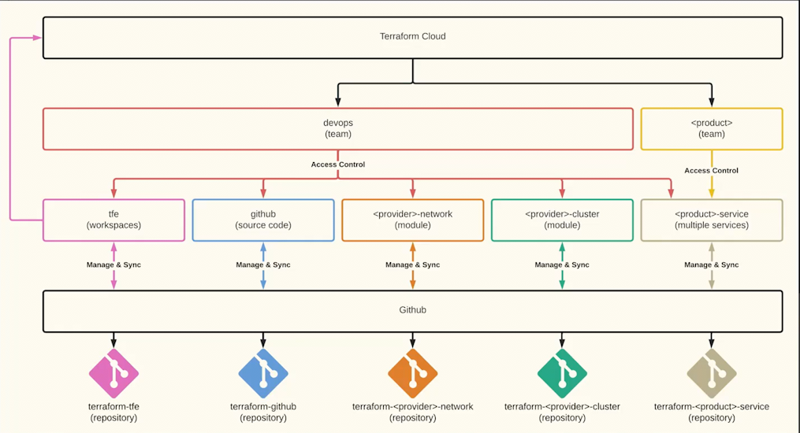

## Overview

This repository contains Terraform configurations for managing infrastructure on Terraform Cloud. It is designed to help teams automate and manage their infrastructure as code, providing a reliable and consistent environment for deployment.

### Prerequisites

- A Terraform Cloud account ([Sign up here](https://app.terraform.io/signup/account))
- Terraform installed on your local machine ([Download Terraform](https://www.terraform.io/downloads.html))
- Access to a AWS

### Setup

1. **Fork or clone this repository** to your version control system.
2. **Configure your Terraform Cloud workspace** to connect with your version control system and set up the necessary environment variables and workspace settings.
3. **Review and customize the Terraform configurations** in this repository to match your infrastructure requirements.

### Executing Terraform Plans

- Navigate to your Terraform Cloud workspace and queue a plan for execution.
- Review the generated plan to ensure it matches your expectations.
- Apply the plan to provision or update your infrastructure.

## License

This project is licensed under the MIT License - see the LICENSE file for details.